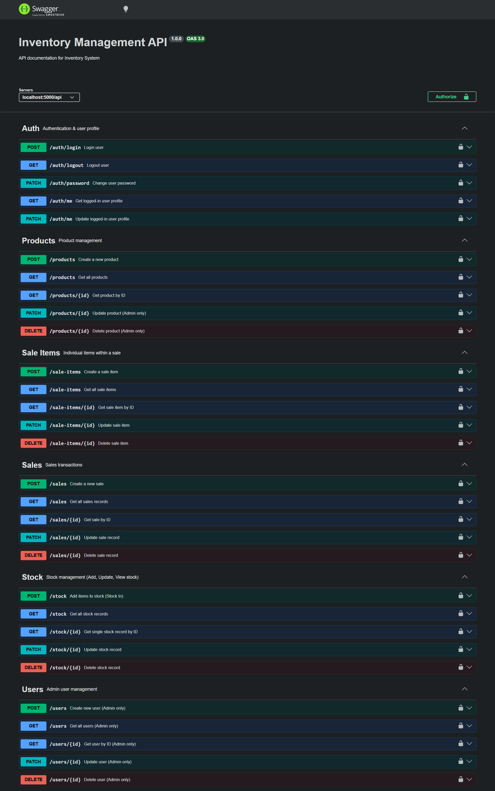

# Inventory Management API

**Inventory Management API** is a complete backend system for managing inventory with a **Role-Based System (RBS)**. Admin and staff roles have different access levels. Admins can manage users, products, stock, and sales, while staff can perform limited operations based on their permissions.

---

## 🛠️ Tech Stack

- **Node.js** (v18+)
- **Express.js**
- **MySQL** (relational database)
- **JWT** for authentication & role-based access
- **Joi/Zod** for request validation
- **Swagger** for API documentation
- **Jest + Supertest** for automated testing

---

## ✨ Features

- User authentication (login/logout) with JWT
- Role-Based Access Control (Admin / Staff)
- CRUD operations for:
  - Users
  - Products
  - Stock
  - Sales
  - Sale items
- Input validation using Zod/Joi
- Fully tested APIs with Jest + Supertest
- Swagger documentation at `/api/docs`

---

## ⚡ Setup & Installation

1. **Clone the repository**

```bash
git clone https://github.com/imaranmalakzai/inventory-management-api
cd inventory-management-api
Install dependencies

npm install


Environment Variables

Create a .env file in the root directory and add:

PORT=5000
DB_HOST=localhost
DB_USER=root
DB_PASSWORD=yourpassword
DB_NAME=inventory_db
JWT_SECRET=your_jwt_secret

💾 Database Setup

Open your MySQL client (e.g., Workbench, phpMyAdmin).

Execute the backup SQL file located in the schema folder.

This will create all required tables (users, products, stock, sales, sale_items).

Default admin credentials:

Email: admin@gmail.com
Password: admin


✅ Use this account to create other users and start managing inventory.

🚀 Running the App

Start the server:

npm run dev


The API will run on http://localhost:5000

Swagger API documentation: http://localhost:5000/api/docs

📖 API Documentation (Swagger)

Swagger UI is available at:

http://localhost:5000/api/docs


Explore all endpoints interactively

Test requests directly from the Swagger interface

Documentation includes:

Auth (login/logout, change password, update profile)

Users CRUD

Products CRUD

Stock management

Sales and sale items

🧪 Testing

Automated tests are written using Jest + Supertest.

Run all tests:

npm test


Tests include:

Authentication (JWT login)

User CRUD

Product CRUD

Stock CRUD

Sales and sale items

🔑 Roles
Role	Permissions
Admin	Full access: manage users, products, stock, sales, and settings
Staff	Limited access: view products, manage stock/sales depending on assigned rights
⚡ Notes / Best Practices

.env file is ignored in Git (.gitignore) to keep secrets safe

Always run npm install before starting the server

Use the admin account to onboard staff users

Swagger /api/docs is the fastest way to understand and test the API

📂 Folder Structure
src/
├── controllers/       # API logic
├── middlewares/       # JWT auth, role-based access
├── repositories/      # DB queries
├── routes/            # API endpoints
├── tests/             # Jest + Supertest tests
├── config/            # DB & server configuration

📌 License

This project is open-source and free to use for personal or portfolio purposes.
!['public/image.png']
```


